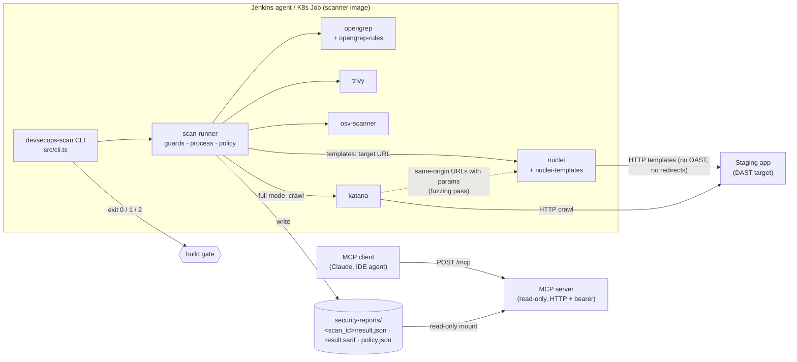

# Architecture

## Goals

- CI runs the security scanners directly and fails builds through a real, configurable gate.
- Every tool is self-hosted: Docker Compose locally, Kubernetes in a cluster.
- AI assistants get triage-friendly access to the results **without** the ability to run scans, reach the network or read arbitrary files.

Non-goals: rewriting scanners, IAST, metrics stacks (Redis/Prometheus/Grafana), managed SaaS connectors, long-running scanner services (SonarQube and the ZAP daemon were removed: every scanner is a short-lived CLI process).

## Components



| Module | Responsibility |
|---|---|
| `src/core/scanners/*` | Run one tool and map its native output to normalized `Finding`s (severity, rule, location, fix, CWE/CVE). `katana.ts` returns the crawl as a same-origin URL list for `nuclei.ts`. |
| `src/core/process.ts` | `spawn` without a shell, timeout, stdout cap, stderr tail. |
| `src/core/guards.ts` | Workspace path containment, image ref validation, the DAST SSRF guard. |
| `src/core/config.ts` | Load `security-rules.yml` (YAML + Joi), resolve rule/template paths (`${VAR}` + relative to the rules file), secrets from `NAME` or `NAME_FILE`. |
| `src/core/policy.ts` | Gate evaluation: thresholds, failed or missing data. |
| `src/core/report-store.ts` | Persist and read results; scan-id validation; realpath containment. |
| `src/core/sarif.ts`, `report.ts` | SARIF 2.1.0, markdown/json reports, and the rule-grouped triage digest. |
| `src/cli.ts` | Jenkins entry point (`sast` / `sca` / `container` / `dast` / `gate` / `report`). |
| `src/mcp/*` | MCP server: tool definitions (`tools.ts`), server factory (`mcp.ts`), Streamable HTTP (`http.ts`), entry point (`server.ts`). |

## Data flow

1. Jenkins checks out the code and runs `devsecops-scan <type> --target … --scan-id … --no-fail` for each scanner, inside the scanner image. For DAST, Nuclei's templates run against the target URL; in `full` mode the runner also crawls with Katana, keeps same-origin GET URLs, and runs Nuclei's fuzzing templates on the ones with parameters.
2. The runner validates the target, runs the tool, normalizes the findings, then writes `result.json`, `result.sarif` and `policy.json`. A crashed scanner still produces a `failed` result, so the evidence that a scan did not run is preserved.
3. `devsecops-scan gate --scan-id …` evaluates all of the build's scans together. Exit `1` (policy FAIL) or `2` (broken or missing results) fails the build.
4. The reports directory is shared with the MCP server as a **read-only** volume (a PVC in Kubernetes).
5. An MCP client calls `list_scans`, then `summarize_findings`, then `get_scan_result` to triage, and `validate_security_policy` or `generate_security_report` to explain the gate.

### Result format

`ScanResult` (`src/core/types.ts`), schema version 1:

```json
{
  "schema_version": 1,
  "scan_id": "sca-trivy-team-app-42",
  "scan_type": "sca",
  "tool": "trivy",
  "status": "completed",
  "target": "/workspace",
  "summary": { "total": 3, "critical": 1, "high": 2, "medium": 0, "low": 0, "info": 0 },
  "findings": [
    {
      "id": "package-lock.json:lodash@4.17.4:CVE-2021-23337",
      "rule_id": "CVE-2021-23337",
      "title": "Command injection",
      "severity": "high",
      "location": { "path": "package-lock.json", "package": "lodash", "version": "4.17.4" },
      "fix": "Upgrade lodash to 4.17.21",
      "cve": ["CVE-2021-23337"]
    }
  ],
  "metadata": {}
}
```

Severity mapping:

| Tool | Mapping |
|---|---|
| Opengrep | ERROR → high, WARNING → medium, INFO → low (same output format as Semgrep) |
| Trivy | Native levels |
| OSV-Scanner | CVSS `max_severity` bucketed (≥ 9 critical, ≥ 7 high, ≥ 4 medium); otherwise the GHSA level |
| Nuclei | The template's `info.severity` (critical/high/medium/low/info; `unknown` → medium) |

An unknown severity becomes `medium`, which is the conservative choice for a gate.

### Policy semantics

The effective threshold for a severity is `<scan_type>.thresholds[severity]` if set, otherwise `global_policy.thresholds[severity]`, otherwise unlimited (`null` also means unlimited).

The decision is `PASS` only when all of the following hold:

- at least one result was evaluated;
- every result is `completed`;
- every summary count is a valid integer and is not lower than the number of findings recorded for that severity;
- no count exceeds its threshold;

Otherwise the decision is `FAIL`, or `WARN` when `enforcement_level: permissive`.

## Threat model

Trust boundaries:

- **CI → scanner CLI.** Pipeline parameters are semi-trusted (anyone who can edit the Jenkinsfile).
- **Scanned code and DAST responses → reports.** Untrusted.
- **MCP client → MCP server.** Authenticated but untrusted. The client may be an LLM acting on injected instructions.

| # | Threat | Mitigations | Residual risk |
|---|---|---|---|
| 1 | A stolen token or a malicious MCP client abuses the server | Tools are read-only: no scans, no URL fetches, no writes. Bearer token ≥ 32 chars compared in constant time. Ingress restricted by NetworkPolicy, and the MCP pod has no egress. Ports bind to loopback in Compose. | Read access to findings means knowledge of vulnerabilities. Put TLS (ingress) in front and rotate the token. |
| 2 | Path traversal or arbitrary file read through MCP | No tool takes a path (the old `policy_file` argument is gone). Scan ids match `^[a-z0-9][a-z0-9_-]{2,127}$`. Directories and files are realpath-checked to stay inside the reports dir, so symlinks are refused. Read-only mount. | None known. |
| 3 | SSRF through the DAST target | Only the CLI accepts URLs; MCP cannot. http(s) only, no embedded credentials. Every resolved IP is checked: loopback, link-local/metadata (169.254.0.0/16, fd00:ec2::254), 0/8, multicast and reserved ranges are blocked. An optional host/CIDR allowlist restricts targets to it. Katana output is filtered to the target's own origin before Nuclei sees it. Nuclei runs with redirects disabled (`-dr`). | DNS rebinding between the check and the scanners' own lookups. Use the allowlist plus an egress NetworkPolicy on scanner pods for strict environments. |
| 4 | Argument injection into scanner CLIs | `spawn` with argv (no shell). `--` before positional targets (Opengrep, Trivy, OSV-Scanner); Katana and Nuclei get the URL as an option value or a list file. Flag-like targets and config values (rule paths, excludes, templates) are refused; Nuclei tags and template ids are pattern-validated. Image refs are regex-validated. Targets are confined to `SCAN_WORKSPACE_ROOTS`. | None known. |
| 5 | Prompt injection via finding text (code comments, HTTP responses) | Tool descriptions mark finding text as untrusted. The server has no tool an injected instruction could abuse. | The client LLM may still be misled in its own reasoning; humans approve fixes. |
| 6 | Secret leakage | Trivy secret findings never copy `Match`/`Code`. Nuclei runs with `-or -ot` and its `extracted-results`, `curl-command`, request and response fields are never copied into reports. Interactsh is disabled (`-ni`), so no target details go to public OAST servers. The only secret left is the MCP token (env or `*_FILE`, no default). Logs carry no tokens. | Opengrep and Nuclei findings quote code locations and URLs, which can still reveal sensitive structure. |
| 7 | Tampered or forged results | MCP mounts the reports read-only. The policy cross-checks summaries against findings. Existing scan ids are never overwritten. | Anyone with write access to the volume can forge a whole result. Signing results is future work. |
| 8 | Denial of service | Scanner timeouts and stdout caps. 256 KB request body limit. Tool responses are capped and paginated. Stateless HTTP sessions. | No rate limiting in the app; use the ingress or reverse proxy for that. |
| 9 | Supply chain of the images | Tool versions pinned in the `Dockerfile`. Opengrep binary checked against a pinned SHA-256. OSV-Scanner and Katana built from pinned module versions (checksum-verified by the Go toolchain). nuclei-templates pinned to a tag and opengrep-rules to a commit, both baked into the image. Non-root images. | Pin base images by digest and scan the scanner image itself (`devsecops-scan container`). Community templates and rules are third-party content: review updates before bumping the pins. |
| 10 | Dangerous DAST templates | Only `http` protocol templates run (`-pt http`); `code` templates need `-code`, which is never passed. `dos` and `intrusive` tags are excluded by default. Fuzzing templates only run in `full` mode. Rate limit and concurrency are set from the policy. | A policy edit can re-enable intrusive tags; review changes to `security-rules.yml` like code. |

## Future work

- Signed results (for example, cosign or HMAC per `result.json`) so the gate and MCP can detect forgery.
- An offline OSV database mode for air-gapped runners.
- Authenticated DAST (Nuclei `-secret-file`, Katana headers or cookies) configured from the rules file.
- Katana JSONL as direct Nuclei input (keeping POST forms and bodies for fuzzing) once Nuclei supports it in a release.
- Rate limiting and per-client tokens on the MCP endpoint.
